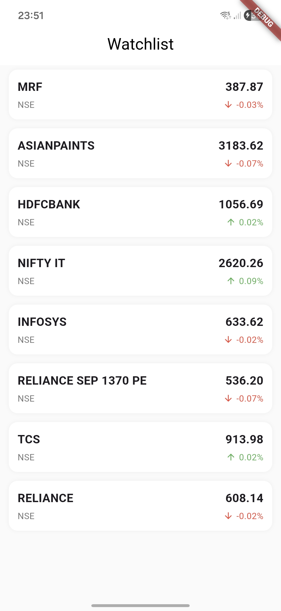
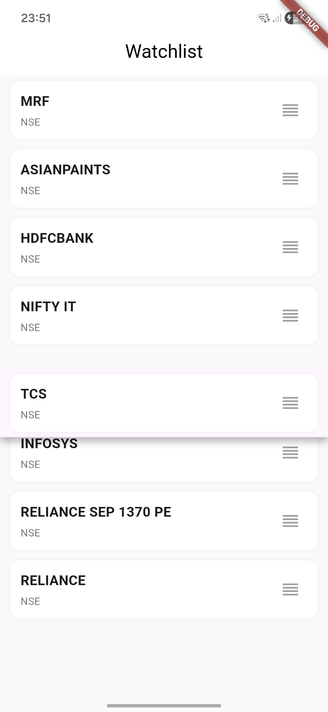
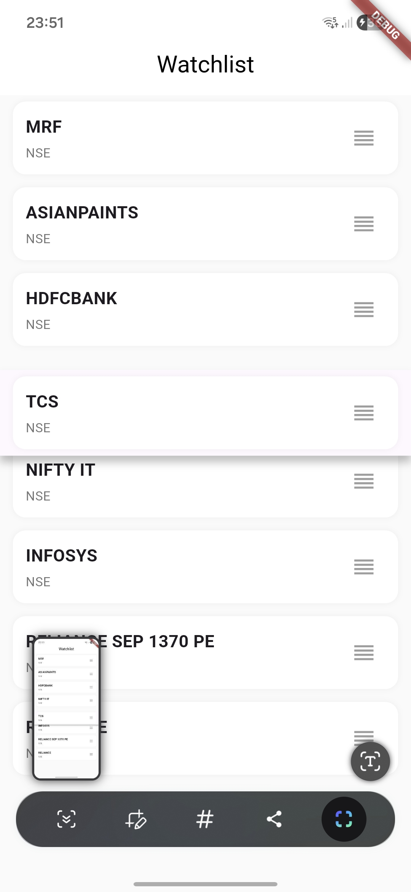
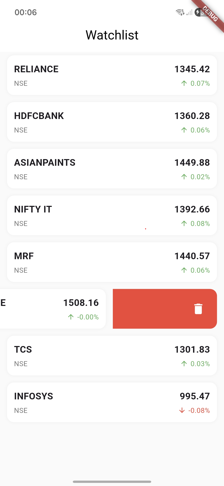

# Flutter Watchlist (Assignment)

This project is a simple watchlist screen built using Flutter as part of an assignment. The main goal was to implement reordering of stocks using BLoC state management.

---

## What I implemented

- Reorderable watchlist using drag & drop
- State management using BLoC
- Swipe to delete (extra feature)
- Clean UI with basic trading-style layout
- Smooth drag animation

---

## Approach

I used the BLoC pattern to keep UI and logic separate.

- BLoC handles all state changes (reorder, delete, load data)
- UI listens to state and updates accordingly
- Repository provides stock data

Reordering is handled inside the BLoC by creating a new list, removing the item from old index and inserting it at the new index.

---

## Project Structure

I followed a feature-based structure:
```text
lib/
 └── features/
      └── watchlist/
           ├── data/
           ├── presentation/
                ├── bloc/
                ├── cubit/
                ├── screens/
                ├── widgets/
```
---
## Screenshots

## Screenshots

### Watchlist Screen
<p align="center">
  
</p>

### Drag & Reorder
<p align="center">
  
  
</p>

### Swipe to Delete
<p align="center">
  
</p>
## How to run

```bash
git clone https://github.com/Gourav0967/flutter-watchlist-bloc.git
cd flutter-watchlist-bloc
flutter pub get
flutter run